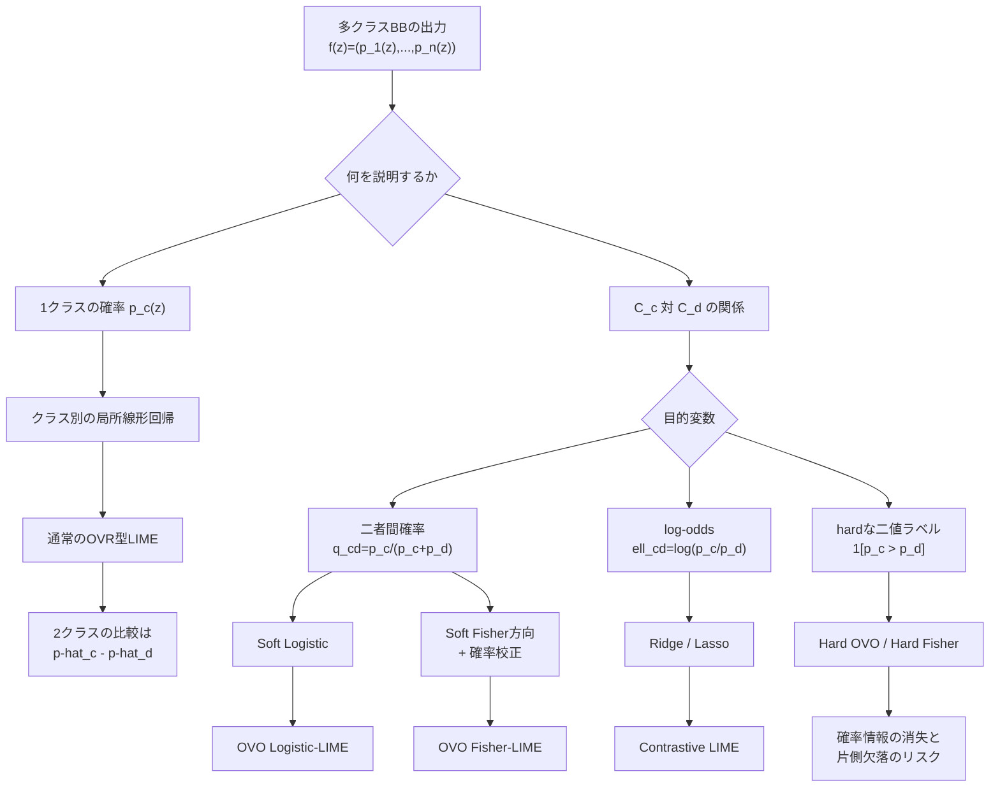
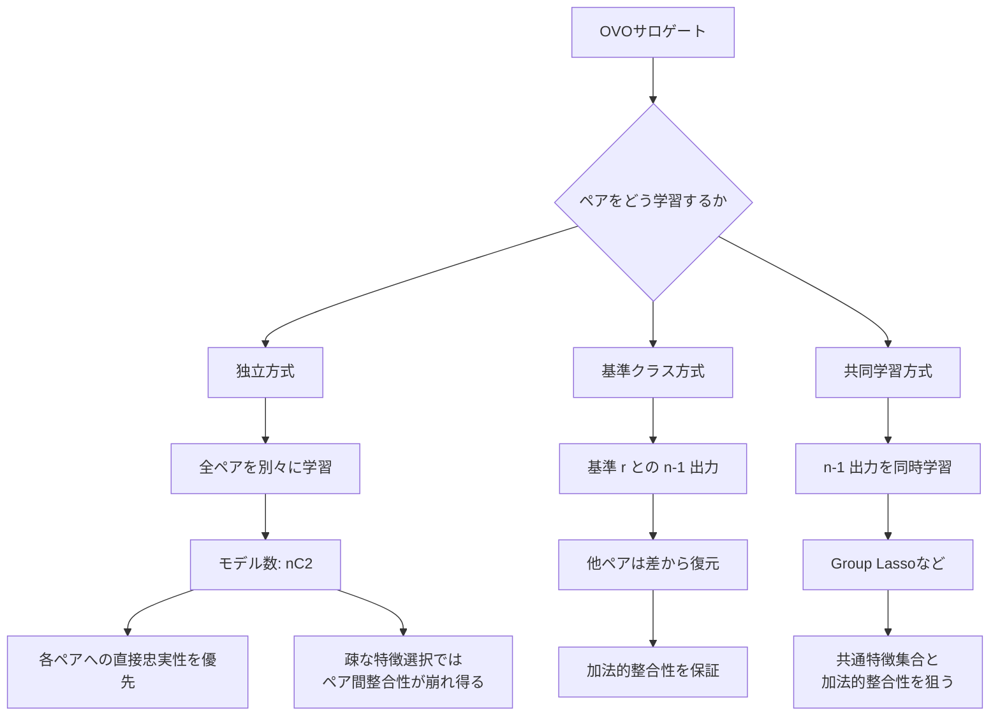

# 多クラスLIMEにおけるOne-vs-One説明手法の整理

更新日: 2026-09-03

位置づけ: 研究案の定式化と比較候補の整理。実装済みの仕様書ではない。

## 0. このページの目的

多クラス分類に対する従来のLIMEは、ブラックボックス（BB）が返す各クラスの予測確率を、クラスごとに別々の局所線形モデルで近似する。この説明から2クラスの差を計算することはできるが、「なぜクラス $C_c$ であってクラス $C_d$ ではないのか」という問いを、最初から直接近似する方法も考えられる。

本ページでは、これを便宜上 **One-vs-One（OVO）型のLIME** と呼び、次を整理する。

- 従来のOne-vs-Rest（OVR）型LIMEとの違い
- 二者間確率とlog-oddsの定義
- OVO Logistic-LIME、Contrastive LIME、OVO Fisher-LIMEの違い
- 全クラスペアを独立に学習する場合と、共同学習する場合の違い
- 比較実験で使用すべき評価指標

「OVO-LIME」「OVO Logistic-LIME」「OVO Fisher-LIME」は、この研究内で設計を区別するための作業名である。既存研究で確立した固有の手法名であるとは、現時点では主張しない。

**研究の中心的な問い（2026-09-06に確定）**：「黒箱の予測クラス$c^*$に対し、特定の競合クラス$c'$との違いを説明するとき、通常のクラス別LIME（OVR）より、そのクラス対を直接近似する方式（OVO）の方が、少ない表示特徴数で忠実に説明できるか」。ソフトラベル交差エントロピー版（提案C）の改善はこの中心的な問いの下位仮説として位置づける。

**重要な訂正（2026-09-06）**：「OVOは2本のOVR回帰を引き算するのではなく最初から直接回帰するから優れる」という説明は不正確。Ridge回帰は目的変数に対して線形演算子なので、同一設計・重み・正則化なら「OVRの係数差」と「$p_c-p_d$の直接Ridge回帰」は数式上同一の推定量になる（`src/check_identities.py`で機械精度まで確認済み）。OVOが実際に変えているのは**目的変数そのもの**（確率差$p_c-p_d$ → 対数比$\log(p_c/p_d)$または二択確率$q=p_c/(p_c+p_d)$）であり、「直接 vs 引き算」という当てはめ方の違いではない。同様に、密なRidge版のContrastiveでは循環整合性$\hat\beta_{ab}+\hat\beta_{bc}=\hat\beta_{ac}$が「何かに強制されて」ではなく線形性の帰結として数式上厳密に成立する（Lasso版では崩れうる）。詳細は`docs/EXPERIMENT_LOG.md`「0.1 訂正記録」参照。

**OVOの価値の説明（一般化された動機）**：黒箱のスコアが $s_c(z)=a(z)+u_c(z)$（$a$はクラス共通成分、$u_c$はクラス固有成分）という形で書けるとき、
$$\log\frac{p_c(z)}{p_d(z)} = u_c(z) - u_d(z)$$
となり、共通成分$a(z)$が厳密に消える。OVRの説明（$p_c$を近似）は共通成分と固有成分が混ざった量を近似するのに対し、OVOはクラス対の識別に必要な成分だけを取り出せる、という点が「精度が良い」以前の、質的な利点。ただし$p_c,p_d$が両方とも小さい局所領域でも$q$は強い選好を示しうるため、説明を提示する際は元の$p_c,p_d$も併記すべき。

長いページなので、最初は「1. 全体像」「2. 問題設定」「14. 推奨する最初の比較実験」だけを読めば、現在の候補と次の作業を把握できる。各手法の数式を確認するときは、6〜11節を参照する。

## 1. 全体像

手法が多く見える原因は、次の3つの選択を同時に議論しているためである。

1. **何を目的変数にするか**
2. **どのサロゲートで学習するか**
3. **複数のクラスペアを独立に学習するか、共同で学習するか**

現段階で中心となる比較候補は、次の4つである。

1. **OVR-LIMEの差分**: 既存手法から作る比較基準
2. **OVO Logistic-LIME**: 二者間確率を直接近似
3. **Contrastive LIME**: 二者間log-oddsを線形回帰
4. **OVO Fisher-LIME**: Fisherで判別方向を求め、二者間確率へ校正

Hard OVOは補助的な比較候補とし、当面の主手法にはしない。

## 2. 問題設定

### 2.1 クラス集合とブラックボックス

クラス集合を

$$
\mathcal C=\{C_1,C_2,\ldots,C_n\}
$$

とする。ブラックボックス分類器を

$$
f:\mathcal X\rightarrow\Delta^{n-1}
$$

とし、入力 $z$ に対して

$$
f(z)=\left(p_1(z),p_2(z),\ldots,p_n(z)\right)
$$

を返すとする。ここで、

$$
p_i(z)=P_{\mathrm{BB}}(Y=C_i\mid z)
$$

は、BBが出力したクラス $C_i$ の予測確率であり、

$$
0\leq p_i(z)\leq1,
\qquad
\sum_{i=1}^{n}p_i(z)=1
$$

を満たす。

添字にクラス名を使って $p_{C_i}(z)$ と書いてもよい。本ページでは式を短くするため、主に $p_i(z)$ と書く。

重要なのは、$p_i(z)$ はサロゲートの出力ではなく、BBの出力だという点である。サロゲートの予測にはハットを付け、$\hat p_i(z)$ または $\hat q_{c,d}(z)$ と書く。

### 2.2 説明点、摂動点、局所重み

説明対象の入力を $x_0$ とする。その周辺に $M$ 個の摂動点

$$
Z=\{z_1,z_2,\ldots,z_M\}
$$

を生成し、説明点に近い摂動ほど大きくなる局所重み

$$
\pi_m
=
\exp\left(
-\frac{D(x_0,z_m)^2}{\sigma^2}
\right)
$$

を与える。

サロゲートで使用する解釈可能な特徴表現を $h(z)$ と書く。表形式データなら、標準化した連続値やビン化した特徴がこれに当たる。本ページでは、式を簡潔にするため $h(z)$ を単に $z$ と書く場合がある。

### 2.3 BBが付けるのは原則として確率である

通常の分類LIMEでは、各摂動点をBBへ入力して、hardな予測ラベルだけではなく、原則として全クラスの予測確率を取得する。

$$
z_m
\xrightarrow{\mathrm{BB}}
\left(p_1(z_m),\ldots,p_n(z_m)\right)
$$

この確率を、局所サロゲートの教師信号として使用する。元のBBがOVR分類器、softmax分類器、ランダムフォレストのどれで学習されたかは別問題であり、LIMEはBBの内部学習方式を必要としない。

## 3. 通常のOVR型LIME

クラス $C_c$ を説明する通常のLIMEは、BBの出力 $p_c(z_m)$ を目的変数として、局所線形モデル

$$
\hat p_c(z)
=
a_c+\boldsymbol\beta_c^\top h(z)
$$

を学習する。概念的な目的関数は、

$$
\min_{a_c,\boldsymbol\beta_c}
\sum_{m=1}^{M}
\pi_m
\left[
p_c(z_m)
-
\left(a_c+\boldsymbol\beta_c^\top h(z_m)\right)
\right]^2
+
\lambda\Omega(\boldsymbol\beta_c)
$$

である。

- Ridge回帰なら $\Omega(\beta)=\|\beta\|_2^2$
- Lassoなら $\Omega(\beta)=\|\beta\|_1$
- 表示する特徴数を $K$ 個に制限するなら、$\|\beta\|_0\leq K$ に相当する疎性を考える

### 3.1 OVRから2クラスを比較する

$C_c$ と $C_d$ を比較する場合は、2本のサロゲートの差を取る。

$$
\hat p_c(z)-\hat p_d(z)
=
(a_c-a_d)
+
(\boldsymbol\beta_c-\boldsymbol\beta_d)^\top h(z)
$$

したがって、ペア $(c,d)$ の特徴係数は、

$$
\boldsymbol\gamma_{c,d}
=
\boldsymbol\beta_c-\boldsymbol\beta_d
$$

となる。

この係数が表すのは、$p_c$ 自体の変化ではなく、$p_c-p_d$ という**絶対確率差の変化**である。

### 3.2 OVR差分の課題

- $C_c$用と $C_d$用で選択特徴が異なると、差分説明を人が組み立てにくい
- クラス別の疎な特徴選択によって、係数差が不安定になる可能性がある
- 目的関数は各クラス確率の近似であり、特定の $(c,d)$ の比較を直接最適化していない
- 一方、同じ摂動、重み、全特徴、正則化を用いる線形Ridgeでは、$p_c-p_d$ の直接回帰とOVRの係数差は線形性により一致する

最後の性質は重要である。OVOで単に $p_c-p_d$ を同じRidge回帰へ入れるだけでは、OVRとの差別化にならない。OVO独自の目的変数として、二者間確率またはlog-oddsを使用する理由がここにある。

## 4. 二者間確率

### 4.1 定義

クラス $C_c$ と $C_d$ の二者間条件付き確率を、

$$
q_{c,d}(z)
=
\frac{p_c(z)}{p_c(z)+p_d(z)}
$$

と定義する。これは、BBが出した $p_c(z)$ と $p_d(z)$ だけを残して再正規化した値である。

$$
q_{d,c}(z)=1-q_{c,d}(z)
$$

また、

$$
q_{c,d}(z)>0.5
\iff
p_c(z)>p_d(z)
$$

なので、$q_{c,d}$ は $C_c$ と $C_d$ のどちらがBB上で有利かを保存する。

### 4.2 注意: BBを2クラスで再学習した確率ではない

$q_{c,d}$ は、$C_c,C_d$ だけを使ってBBを再学習した場合の確率ではない。元の多クラスBBが返した確率ベクトルから、説明時に2クラスだけを再正規化した量である。

したがって、「他クラスを消す」とは、原則として次を意味する。

- 他クラスの確率列を二者間目的変数の計算に使わない
- 摂動サンプル自体は削除しない

### 4.3 数値例

BBがある摂動点に対して、

$$
(p_c,p_d,p_e)=(0.45,0.30,0.25)
$$

を返したとする。このとき、

$$
q_{c,d}
=
\frac{0.45}{0.45+0.30}
=0.60
$$

である。これは、「$C_c$と$C_d$だけに限定して比率を見れば、$C_c$側が60%」という意味である。

## 5. log-odds

### 5.1 オッズとlog-odds

確率 $q$ に対するオッズは、

$$
\operatorname{odds}(q)
=
\frac{q}{1-q}
$$

である。その対数

$$
\operatorname{logit}(q)
=
\log\frac{q}{1-q}
$$

を、log-oddsまたはlogitと呼ぶ。これは本研究で新しく付けた名称ではなく、統計学やロジスティック回帰で一般的に使われる概念である。

二者間確率については、

$$
\frac{q_{c,d}(z)}{1-q_{c,d}(z)}
=
\frac{p_c(z)}{p_d(z)}
$$

なので、二者間log-oddsは、

$$
\ell_{c,d}(z)
=
\log\frac{p_c(z)}{p_d(z)}
$$

となる。

確率が0に近い場合に備え、実装上は、

$$
\ell_{c,d}^{(\varepsilon)}(z)
=
\log
\frac{p_c(z)+\varepsilon}
{p_d(z)+\varepsilon}
$$

とする。

### 5.2 sigmoidで確率へ戻す

sigmoid関数を、

$$
\sigma(t)
=
\frac{1}{1+e^{-t}}
$$

とする。logitとsigmoidは逆関数なので、

$$
q_{c,d}(z)
=
\sigma\left(\ell_{c,d}(z)\right)
$$

である。

log-oddsを用いる主な利点は次である。

- 実数全体を線形モデルで扱い、sigmoidによって最終出力を $(0,1)$ に収められる
- $p_c=p_d$ の境界が $\ell_{c,d}=0$ になる
- 向きを逆にすると $\ell_{d,c}=-\ell_{c,d}$ になる
- $\ell_{c,d}+\ell_{d,e}=\ell_{c,e}$ という加法的関係を持つ

一方、$p_c$ または $p_d$ が0に近いと値が極端になり、$\varepsilon$ の影響を受ける。確率を最も忠実に近似する目的なら、log-oddsの二乗回帰が必ず最適とは限らない。

## 6. 候補手法1: OVO Logistic-LIME

### 6.1 モデル

二者間確率を、

$$
\hat q_{c,d}(z)
=
\sigma\left(
a_{c,d}
+
\boldsymbol\beta_{c,d}^\top h(z)
\right)
$$

で近似する。

BBの二者間確率 $q_{c,d}(z_m)$ をsoft labelとして使い、重み付きcross entropyを最小化する。

$$
\min_{a_{c,d},\boldsymbol\beta_{c,d}}
-\sum_{m=1}^{M}\pi_m
\left[
q_m\log\hat q_m
+
(1-q_m)\log(1-\hat q_m)
\right]
+
\lambda\Omega(\boldsymbol\beta_{c,d})
$$

ここで、

$$
q_m=q_{c,d}(z_m),
\qquad
\hat q_m=\hat q_{c,d}(z_m)
$$

である。

### 6.2 特徴係数の意味

$x_j$ が1単位増加したとき、二者間log-oddsは $\beta_{c,d,j}$ 増加し、$C_c$対$C_d$のオッズは、

$$
e^{\beta_{c,d,j}}
$$

倍になる。

二者間確率の変化率は、

$$
\frac{\partial\hat q_{c,d}}{\partial x_j}
=
\hat q_{c,d}(1-\hat q_{c,d})\beta_{c,d,j}
$$

なので、同じ係数でも現在の確率によって確率変化量は異なる。

### 6.3 位置づけ

最終的に二者間確率を正確に表示したい場合の、最も直接的な候補である。確率近似を直接最適化する一方、Fisherの判別方向最大化は行わない。

## 7. 候補手法2: Contrastive LIME

### 7.1 モデル

二者間log-oddsを目的変数として、線形モデル

$$
\hat\ell_{c,d}(z)
=
a_{c,d}
+
\boldsymbol\beta_{c,d}^\top h(z)
$$

を学習する。

$$
\min_{a_{c,d},\boldsymbol\beta_{c,d}}
\sum_{m=1}^{M}
\pi_m
\left[
\ell_{c,d}^{(\varepsilon)}(z_m)
-
\hat\ell_{c,d}(z_m)
\right]^2
+
\lambda\Omega(\boldsymbol\beta_{c,d})
$$

最終的な二者間確率は、

$$
\hat q_{c,d}(z)
=
\sigma\left(\hat\ell_{c,d}(z)\right)
$$

で得る。

### 7.2 OVO Logistic-LIMEとの違い

- OVO Logistic-LIMEは、確率空間でcross entropyを最小化する
- Contrastive LIMEは、log-odds空間で二乗誤差を最小化する

両方ともモデル内部の線形値はlog-oddsとして解釈できるが、最適化している誤差が異なる。

### 7.3 OVR差分との非同値性

次の2つは区別する必要がある。

- $p_c-p_d$ を同じRidgeで直接回帰する場合は、OVRの2本のRidgeを引いたものと線形性により一致する
- $\log(p_c/p_d)$ の回帰は非線形変換を挟むため、OVRの確率回帰2本を引いたものとは数学的に一致しない

## 8. 候補手法3: OVO Fisher-LIME

### 8.1 基本的な発想

OVO Logistic-LIMEは二者間確率の誤差を直接最小化する。OVO Fisher-LIMEは、最初に $C_c$ と $C_d$ を分離するFisher方向を求め、入力を1次元の判別スコアへ射影する。

$$
t_{c,d}(z)
=
\boldsymbol w_{c,d}^\top h(z)
$$

その後、この1次元スコアを二者間確率へ校正する。

$$
\hat q_{c,d}(z)
=
\sigma\left(
a_{c,d}
+
b_{c,d}t_{c,d}(z)
\right)
$$

したがって、最終的なlog-odds係数は、

$$
\boldsymbol\gamma_{c,d}
=
b_{c,d}\boldsymbol w_{c,d}
$$

となる。

### 8.2 hard Fisher

最も単純な方法では、各摂動点を、

$$
y_{c,d}(z_m)
=
\mathbf 1[p_c(z_m)>p_d(z_m)]
$$

によって二値化する。

ただし、局所近傍の全摂動点で $p_c(z_m)>p_d(z_m)$ となると、$C_d$側のサンプルが存在せず、Fisher方向を計算できない。さらに、BBが出した確率の強さを0/1へ潰してしまう。

そのため、hard Fisherは比較対象として残し得るが、主な提案候補にはしない。

### 8.3 soft Fisher

二者間確率

$$
q_m=q_{c,d}(z_m)
$$

を、摂動点 $z_m$ の $C_c$への所属度とみなす。

$$
u_{m,c}=q_m,
\qquad
u_{m,d}=1-q_m
$$

局所カーネル重みも含めたsoftなクラス平均を、

$$
\boldsymbol\mu_c
=
\frac{
\sum_m\pi_mq_mh(z_m)
}{
\sum_m\pi_mq_m
}
$$

$$
\boldsymbol\mu_d
=
\frac{
\sum_m\pi_m(1-q_m)h(z_m)
}{
\sum_m\pi_m(1-q_m)
}
$$

とする。

softなクラス内散布行列は、

$$
\begin{aligned}
S_W
=&
\sum_m\pi_mq_m
(h(z_m)-\mu_c)(h(z_m)-\mu_c)^\top\\
&+
\sum_m\pi_m(1-q_m)
(h(z_m)-\mu_d)(h(z_m)-\mu_d)^\top
\end{aligned}
$$

である。正則化を加えたFisher方向を、

$$
\boldsymbol w_{c,d}
=
(S_W+\lambda I)^{-1}
(\boldsymbol\mu_c-\boldsymbol\mu_d)
$$

とする。

これは、次のFisher基準を最大化する方向に対応する。

$$
J(\boldsymbol w)
=
\frac{
\left[
\boldsymbol w^\top(\boldsymbol\mu_c-\boldsymbol\mu_d)
\right]^2
}{
\boldsymbol w^\top S_W\boldsymbol w
}
$$

### 8.4 確率校正

Fisher方向 $\boldsymbol w_{c,d}$ は、基本的には方向だけを与える。$\boldsymbol w$の大きさには回帰係数と同じ自然な尺度がないため、生のFisherスコアを確率や他手法の係数と直接比較しない。

そこで、

$$
t_m=\boldsymbol w_{c,d}^\top h(z_m)
$$

を1次元入力として、

$$
\hat q_m
=
\sigma(a_{c,d}+b_{c,d}t_m)
$$

を $q_m$ へsoft-label cross entropyでフィットする。この確率校正を含めて、OVO Fisher-LIMEと呼ぶ。

### 8.5 仮説とリスク

期待する仮説は、Fisherによる分離方向が、高次元・相関特徴のある局所近傍で安定する可能性である。一方で、二者間確率誤差を直接最適化しないため、OVO Logistic-LIMEより確率忠実性が低い可能性がある。

既存実験ではhard Fisherの安定性優位は確認されず、正規化後にはOVRより不安定だった。soft Fisherはサンプル欠落を避け、安定性をOVRに近い水準まで回復したが、フルグリッド検証は未完了である。したがって、Fisherの優位性を前提にせず、仮説として比較する必要がある。

## 9. Hard OVOを主候補にしない理由

Hard OVOには、主に2つの作り方がある。

1. BBのargmaxが $c,d$ の摂動点だけ残す
2. 全摂動点を $\mathbf 1[p_c>p_d]$ で二値化する

1番目は通常のOVO分類に近いが、次の問題がある。

- ペアごとに使用する摂動集合が異なる
- 第3クラスが優勢な局所領域を捨てる
- ペアによってサンプル数が大きく異なる
- 片方のクラスが近傍から消える

2番目は全摂動点を使用できるが、$p_c=0.51,p_d=0.49$ と $p_c=0.99,p_d=0.01$ を同じラベル1として扱い、確率の強さを捨てる。

したがって、BBが確率を返せる前提では、二者間確率を使うsoft方式を優先する。

## 10. 複数ペアの学習構造

OVOの目的変数を決めた後、複数のペアをどのように学習するかを決める。

### 10.1 独立方式

クラスペア集合を、

$$
\mathcal P
=
\{(c,d):1\leq c<d\leq n\}
$$

とし、各ペアのサロゲートを別々に学習する。必要なモデル数は、

$$
|\mathcal P|
=
\binom n2
=
\frac{n(n-1)}2
$$

である。

摂動点とBB確率行列は全ペアで共有できるため、BBへの問い合わせ回数は増えない。増えるのは主にサロゲートのフィット回数である。

向きが逆のモデルは、

$$
\hat\ell_{d,c}(z)
=
-\hat\ell_{c,d}(z)
$$

として復元できるため、別に学習する必要はない。

### 10.2 基準クラス方式

基準クラス $r$ を1つ決め、

$$
y_c(z)
=
\log\frac{p_c(z)}{p_r(z)},
\qquad c\neq r
$$

の $n-1$ 出力を学習する。

$$
\hat s_c(z)
=
a_c+\boldsymbol\beta_c^\top h(z),
\qquad
\hat s_r(z)=0
$$

とすれば、任意のペアを、

$$
\hat\ell_{c,d}(z)
=
\hat s_c(z)-\hat s_d(z)
$$

で復元できる。

この構成では、

$$
\hat\ell_{c,d}
+
\hat\ell_{d,e}
=
\hat\ell_{c,e}
$$

が必ず成立する。

### 10.3 共同学習とGroup Lasso

基準クラスに対する $n-1$ 個のlog-oddsを、1つの多出力モデルとして共同学習する。

目的変数行列を、

$$
Y_{m,c}
=
\log
\frac{p_c(z_m)+\varepsilon}
{p_r(z_m)+\varepsilon}
$$

とし、係数行列を、

$$
B\in\mathbb R^{D\times(n-1)}
$$

とする。行単位のGroup Lassoを使う場合の目的関数は、

$$
\min_{a,B}
\frac12
\sum_{m=1}^{M}
\pi_m
\left\|
Y_m-a-B^\top h(z_m)
\right\|_2^2
+
\lambda
\sum_{j=1}^{D}\|B_{j,:}\|_2
$$

である。

$\|B_{j,:}\|_2=0$ なら、特徴 $j$ は全出力で同時に除外される。これにより、すべてのクラス比較が共通の表示特徴集合を持つ。

一方、あるペアだけに重要な特徴も全体の特徴予算の影響を受ける。このため、独立OVOとの忠実性・簡潔性のトレードオフを確認する必要がある。

本節では符号の向きを $\log(p_c/p_r)$ と定義した。現在のリモート実装は逆向きの $\log(p_r/p_c)$ を保持している。両者は符号を反転しただけで同じ情報を持つが、確率復元式の指数の符号も定義に合わせる必要がある。

## 11. 推移性と加法的整合性

BBの真のlog-oddsには、常に、

$$
\ell_{c,d}
+
\ell_{d,e}
=
\ell_{c,e}
$$

が成立する。

この式が成立すれば、例えば、

$$
\ell_{c,d}>0,
\qquad
\ell_{d,e}>0
$$

から、

$$
\ell_{c,e}>0
$$

が従い、循環的な順位は発生しない。

独立OVOについては、「独立に学習しただけで必ず推移性が失われる」とは限らない。同じ摂動、同じ局所重み、同じ全特徴、同じRidge正則化を使い、目的変数がlog-oddsなら、回帰演算の線形性によって加法的関係も保存される。

整合性が崩れやすいのは、主に次の場合である。

- ペアごとに異なる特徴を選ぶ
- ペアごとに異なる摂動点または局所重みを使う
- ペアごとに異なる正則化を使う
- hard OVOでペアごとにサンプルを削除する
- 非線形サロゲートを独立に学習する

したがって、研究上の問題は「OVOは必ず推移性を失う」ではなく、次のように表現する。

> ペアごとに独立した疎なモデル構造を選択すると、クラスペア間の加法的整合性が保証されない。

## 12. ペアの選択と表示

全ペアを内部で学習しても、すべてをユーザーへ表示する必要はない。説明対象のBB予測クラスを、

$$
c^*
=
\arg\max_c p_c(x_0)
$$

とする。標準表示では、$c^*$を含むペアから選ぶのが自然である。

候補は次の通りである。

1. **2位クラス**: $x_0$で2番目に予測確率が高いクラス
2. **確率差が小さいクラス**: $|q_{c^*,d}(x_0)-0.5|$ が小さいクラス
3. **境界までの距離が短いクラス**: 少ない局所変更で逆転しやすいクラス
4. **ユーザー指定クラス**
5. **業務上、混同が危険なクラス**

ペア選択と手法評価は分ける必要がある。忠実性が高かったペアだけを選んで手法全体の精度として報告すると、選択バイアスになる。

- 手法評価: 全ペア、または実験前に定めたペア選択規則で測る
- ユーザー表示: 関連性の高い1〜3ペアへ絞る

## 13. 評価指標

分類器そのものの正解率ではなく、局所サロゲートがBBの二者間判断を再現できるかを評価する。学習用摂動点と評価用摂動点は分ける。

### 13.1 二者間確率の局所忠実性

二者間Brier損失を、

$$
L_{\mathrm{Brier}}
=
\frac{
\sum_m\pi_m
\left(q_{c,d}(z_m)-\hat q_{c,d}(z_m)\right)^2
}{
\sum_m\pi_m
}
$$

とする。値が小さいほど、BBの二者間確率を局所的によく再現している。

soft-label log lossも候補である。

$$
L_{\mathrm{log}}
=
-\frac{1}{\sum_m\pi_m}
\sum_m\pi_m
\left[
q_m\log\hat q_m
+
(1-q_m)\log(1-\hat q_m)
\right]
$$

### 13.2 ペア方向の一致率

$$
A_{c,d}
=
\frac{
\sum_m\pi_m
\mathbf 1
\left[
(p_c(z_m)>p_d(z_m))
=
(\hat q_{c,d}(z_m)>0.5)
\right]
}{
\sum_m\pi_m
}
$$

とする。

近傍全体で常に片方が勝つ場合、常に同じクラスを返すだけでも高得点になる。したがって、次も併記する。

- balanced accuracy
- $|q_{c,d}-0.5|<\tau$ となる境界付近での一致率
- 二者間確率差の大きさ別の一致率

### 13.3 安定性

説明点を固定して摂動乱数を変え、次を測る。

- 単位ベクトルへ正規化した係数方向の分散またはcosine類似度
- top-$K$特徴集合のJaccard類似度
- 特徴係数の符号一致率
- 二者間忠実性の試行間分散

Fisher方向と回帰係数は生の尺度が異なるため、生の係数分散を手法間で直接比較しない。

### 13.4 疎性と理解容易性の代理指標

- 表示特徴数 $K$
- 同じ忠実性を達成するために必要な特徴数
- ペア間の特徴集合の重なり
- 表示するクラスペア数

人間の理解容易性そのものを主張するにはユーザー実験が必要だが、本研究ではユーザー実験を行わず、これらを構造的な代理指標として扱う。

### 13.5 ペア間整合性

独立に学習したlog-oddsサロゲートに対し、三つ組 $(c,d,e)$ のcycle residualを、

$$
R_{c,d,e}(z)
=
\left|
\hat\ell_{c,d}(z)
+
\hat\ell_{d,e}(z)
-
\hat\ell_{c,e}(z)
\right|
$$

とする。

ただし、基準クラス方式や同一設計の全特徴Ridgeでは、この値は構造的に0になる。その場合、性能差を示す指標ではなく、実装が理論的制約を満たしているかを確認するテストとして使う。

### 13.6 計算量

- サロゲートのフィット時間
- モデル数
- メモリ使用量
- BBへの問い合わせ回数

同じ摂動とBB確率を全ペアで共有する限り、OVOによってBB問い合わせ回数は増えない。

## 14. 推奨する最初の比較実験

初期実験では、次の4手法を比較する。

| 手法 | 目的変数 | 学習器 | 主に最適化するもの |
|---|---|---|---|
| OVR-LIME差分 | $p_c,p_d$を別々に使用 | 重み付きRidge/Lasso | 各クラス確率 |
| OVO Logistic-LIME | $q_{c,d}$ | soft-label logistic | 二者間確率 |
| Contrastive LIME | $\log(p_c/p_d)$ | 重み付きRidge/Lasso | 二者間log-odds |
| OVO Fisher-LIME | $q_{c,d}$をsoft所属度に使用 | soft Fisher + 1次元logistic校正 | 判別方向と二者間確率 |

公平な比較のため、次を揃える。

- 同じ説明点
- 同じ学習用摂動点
- 同じ評価用hold-out摂動点
- 同じ局所カーネル重み
- 同じ表示特徴数 $K$
- 同じBB問い合わせ結果
- 可能な範囲で同程度の正則化選択手順

最初は、各説明点の予測1位クラス $c^*$ と2位クラス $d^*$ のペアを主対象にする。その後、全ペアまたは業務上重要なペアへ広げる。

主指標は、次の2つとする。

1. hold-out摂動上の二者間確率損失
2. 境界付近を含むペア方向一致率

補助指標として、正規化した安定性、top-$K$特徴安定性、cycle residual、計算時間を測る。

## 15. 実装状況（2026-09-03時点）

現在のローカル`main`はコミット`9e1122c`で、`origin/main`と同期している。

| 手法 | 実装状況 |
|---|---|
| OVR-LIME | ローカル`main`に実装済み |
| Fisher hard / soft | ローカル`main`に実装済み。ただし現在のsoft Fisherは多クラス重心方式であり、本ページの「ペアごとのsoft Fisher + 1次元確率校正」と完全には同一でない |
| Contrastive LIME | 現在のローカル`main`に`fit_contrastive`と`fit_contrastive_lasso`を実装済み |
| Group Lasso共同log-ratio | 過去のリモート作業ブランチでは実装・修正履歴があるが、現在のローカル`main`の`src/`には未反映 |
| OVO Logistic-LIME | 未実装 |
| OVO Fisher-LIME | `src/diagnose_fisher_direction.py`の`pair_hard`/`pair_soft`として実装・評価済み（2026-09-05）。pooled版との差はほぼゼロ（真の係数とのSpearmanで≤0.005） |
| 共有支持集合＋Contrastive再フィット（二段構成） | `src/surrogates.py`の`shared_support_fisher_soft` / `shared_support_ridge` / `fit_contrastive_on_support`（2026-09-05）。評価は`src/run_shared_support_experiment.py` |

Group Lassoの確率復元では、目的変数を

$$
\ell_k=\log(p_r/p_k)
$$

と定義した場合、正しい逆変換は、

$$
p_r
=
\frac{1}{1+\sum_k e^{-\ell_k}},
\qquad
p_k=p_re^{-\ell_k}
$$

である。修正前の実験結果では符号バグによってHellinger損失が過大評価されていたため、修正前の「Group Lassoは確率忠実性が大きく悪化する」という結論は使用しない。

## 16. 現時点の研究上の問い

最も単純な研究上の問いは、次である。

> 二者間確率を直接近似するOVO型局所サロゲートは、従来のOVR-LIMEから作る差分説明より、競合クラス間の局所確率と決定方向を忠実に説明できるか。

Fisherを含める場合は、次の問いを追加する。

> soft Fisherによる教師あり1次元射影は、二者間確率を直接学習するlogisticサロゲートと比べて、確率忠実性を大きく損なわずに、特徴方向の安定性を改善できるか。

複数ペアの共同学習まで含める場合は、次の問いになる。

> ペアごとの直接忠実性と、多クラス全体での共通特徴構造・加法的整合性の間には、どのようなトレードオフがあるか。

## 17. 次に行う実装

優先順位は次の通りである。

1. ローカルとリモートのブランチ状態を整理し、既存のContrastive LIMEとGroup Lasso実装を再確認する
2. OVO Logistic-LIMEを実装する
3. ペアごとのsoft Fisher方向と1次元確率校正を実装する
4. 共通のhold-out評価用摂動を使い、4手法の二者間確率忠実性と符号一致率を比較する
5. 摂動seedを変え、正規化方向とtop-$K$特徴の安定性を比較する
6. 独立OVOのcycle residualを測り、共同学習を導入する必要性を判断する

## 18. 最短のまとめ

- BBは各摂動点に全クラス確率 $p_i(z)$ を出す
- 従来LIMEは $p_c(z)$ をクラス別に近似する
- OVO型では $q_{c,d}=p_c/(p_c+p_d)$ または $\log(p_c/p_d)$ を直接近似する
- 確率忠実性を直接狙う候補がOVO Logistic-LIMEである
- Fisherを活かす候補がsoft Fisher方向と1次元確率校正を組み合わせたOVO Fisher-LIMEである
- Contrastive LIMEはlog-oddsをRidge/Lassoで直接近似する比較候補である
- 最初は4手法を同じ摂動とhold-out評価点で比較する
- 全ペアを独立に学習する設計から始め、整合性が実際に問題になった場合に基準クラス方式または共同学習を導入する

## 参考資料

- 査読済み文献を中心とした詳しい関連研究整理: [`docs/RELATED_WORK.md`](RELATED_WORK.md)
- Ribeiro, Singh, and Guestrin, *Why Should I Trust You? Explaining the Predictions of Any Classifier*, KDD 2016: <https://doi.org/10.1145/2939672.2939778>
- LIME公式実装: <https://github.com/marcotcr/lime>
- Sokol and Flach, *LIMEtree: Consistent and Faithful Surrogate Explanations of Multiple Classes*, Electronics 2025: <https://doi.org/10.3390/electronics14050929>
- scikit-learn, Linear and Quadratic Discriminant Analysis: <https://scikit-learn.org/stable/modules/lda_qda.html>
